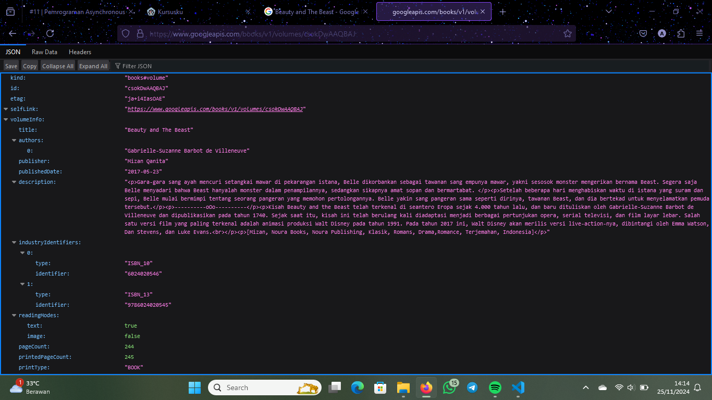
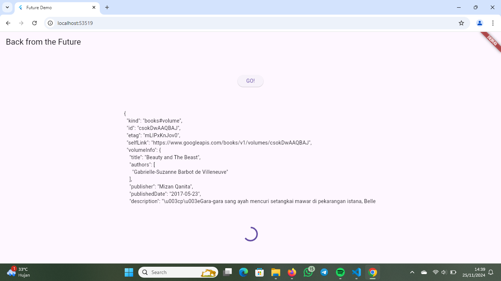
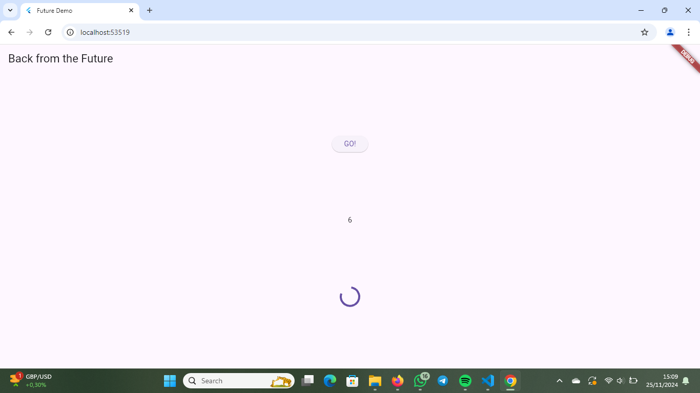
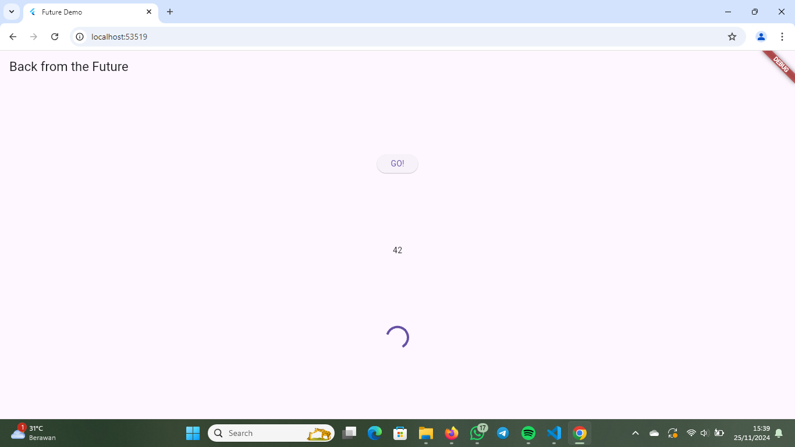
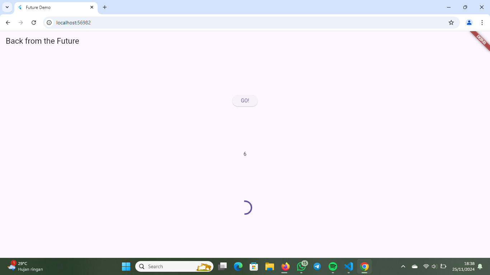

Nama: Arfira Andayani
NIM: 362358302154
Kelas: 2B

SOAL 2

SOAL 3
~ Jelaskan maksud kode langkah 5 tersebut terkait substring dan catchError!
Jawab:
~ Substring adalah metode atau fungsi dalam banyak bahasa pemrograman yang digunakan untuk mengambil bagian tertentu dari sebuah string (sub-bagian string). Fungsi ini biasanya menerima parameter awal (index) dan akhir (opsional) untuk menentukan bagian string yang ingin diambil.

~ catchError biasanya merujuk pada mekanisme penanganan error (kesalahan) dalam bahasa pemrograman.

SOAL 4
~ Jelaskan maksud kode langkah 1 dan 2 tersebut!
Jawab: 
~ Langkah 1 :
Kode tersebut mensimulasikan operasi yang membutuhkan waktu tertentu dengan penundaan menggunakan Future.delayed. Hal ini berguna dalam mengelola proses asinkron dalam aplikasi.

~ Langkah 2 : 
Kode tersebut adalah fungsi asinkron dalam bahasa Dart yang menghitung total nilai yang diperoleh dari tiga fungsi returnOneAsync, returnTwoAsync, dan returnThreeAsync. Fungsi ini juga memperbarui tampilan (UI) dengan memanfaatkan setState untuk mengubah nilai variabel result.

SOAL 5
~ Jelaskan maksud kode langkah 2 tersebut!
Jawab: 
~ Kode pada langkah 2 bertujuan untuk membuat Future secara manual menggunakan Completer. Menunda hasil dengan menunggu selama 5 detik. Dan menyelesaikan Future dengan nilai 42 menggunakan completer.complete.

SOAL 6
~ Jelaskan maksud perbedaan kode langkah 2 dengan langkah 5-6 tersebut!
Jawab: 
~ Langkah 5 :
Kode tersebut adalah fungsi asinkron bernama calculate, yang menggunakan blok try-catch untuk menangani kemungkinan kesalahan saat menjalankan operasi asinkron.

~ Langkah 6 :
Kode tersebut adalah contoh penggunaan Future, yang memanfaatkan metode then dan catchError untuk menangani hasil sukses atau error dari operasi asinkron.

SOAL 7

SOAL 8
~ Jelaskan maksud perbedaan kode langkah 1 dan 4!
Jawab:
~ Langkah 1 (FutureGroup): Menggunakan pustaka eksternal untuk mengelola dan menunggu sekumpulan Future. Memerlukan langkah tambahan seperti .add() untuk menambahkan Future dan .close() untuk menutup grup.

~ Langkah 4 (Future.wait): Menggunakan fitur bawaan Dart untuk langsung menunggu sekumpulan Future tanpa langkah tambahan, cukup dengan memberikan daftar Future.
